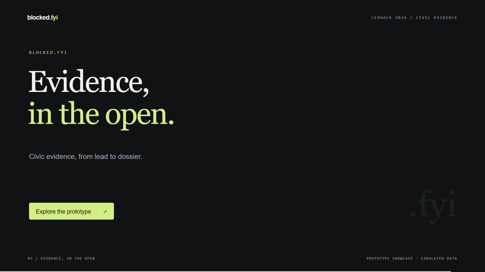

# Blocked.fyi

A LexHack 2026 civic evidence prototype: **Report → Verify → Corroborate → Legal retrieval → Evidence dossier**. FastAPI, SQLAlchemy 2, Pydantic 2, local FAISS, and React/TypeScript. SQLite persists evidence and the verification queue. No paid API or model key is required.

## Demo video

[](brag-output/brag.mp4)

**[Watch the demo (MP4)](brag-output/brag.mp4)** — a 20-second walkthrough of citizen intake, multi-vantage telemetry, and the evidence dossier.

The video uses **simulated data**. Network responses are synthetic, and the legal research shown is not a determination of legality or legal advice.

## Run locally

Prerequisites: Python 3.12–3.14, [uv](https://docs.astral.sh/uv/), Node.js 20.19+ or 22+, and npm.

From the repository root on Windows:

```powershell
./scripts/setup.ps1
# Optional: nine explicitly labeled example dossiers.
./.venv/Scripts/python.exe -m backend.seed
./scripts/run-api.ps1
```

In a second terminal:

```powershell
./scripts/run-ui.ps1
```

Open **http://localhost:5173**. Interactive API documentation: **http://127.0.0.1:8000/docs**. The API runs a queue consumer by default, so submitting a report starts verification automatically. The empty database works without seeding.

Equivalent macOS/Linux commands:

```sh
uv sync
cp backend/.env.example backend/.env
cd frontend && npm ci && cd ..
uv run python -m backend.seed  # optional
uv run uvicorn backend.main:app --host 127.0.0.1 --port 8000
# Another terminal:
cd frontend && npm run dev
```

### Separate worker

Set `EMBEDDED_WORKER=false` in `backend/.env`, restart the API, and run `./scripts/run-worker.ps1` (or `uv run python -m backend.worker`). Both processes must share `DATABASE_URL`. The committed `REPORTED` row is the durable job. Atomic claims prevent duplicate ownership; five-minute leases recover interrupted jobs. Results and audits commit together. Failed jobs become inconclusive with a visible error. Submit a new lead to repeat a completed or failed check.

## Deploy the demo on Render

[`render.yaml`](render.yaml) defines a React Static Site and a single FastAPI Web Service in Singapore with an embedded worker, a health check, and a 1 GB persistent disk for SQLite. **The backend compute and disk are paid resources.** Review Render's estimate before applying the Blueprint. This configuration deploys in **mock mode**; hosting does not provide real regional probe infrastructure.

1. Push this repository, including `render.yaml`, `.python-version`, `uv.lock`, and `frontend/package-lock.json`, to GitHub. Do not commit actual `.env` files or local databases.
2. In [Render](https://dashboard.render.com/), select **New → Blueprint**, connect the repository and select the branch containing these files. Render reads `render.yaml` from the repository root.
3. Render prompts for `CORS_ORIGINS` (backend) and `VITE_API_BASE_URL` (frontend). If the service URLs are not assigned yet, use `https://placeholder.invalid` and `https://placeholder.invalid/api/v1` respectively for this initial build. These deliberately nonfunctional placeholders must be replaced in the next step.
4. Copy the actual public URLs from the two created services; Render may append a suffix to their names. In the backend's **Environment** settings, set `CORS_ORIGINS` to the frontend origin, for example `https://blocked-fyi-web-xxxx.onrender.com` (no trailing slash or path). Save and redeploy the backend. In the Static Site's **Environment** settings, set `VITE_API_BASE_URL` to the backend URL plus `/api/v1`, for example `https://blocked-fyi-api-xxxx.onrender.com/api/v1`. Save and rebuild/deploy the Static Site. Vite embeds this public value at build time, so a rebuild is required after changing it.
5. Visit the backend's `/api/v1/health`: expect `status: "ok"`, `probe_mode: "mock"`, and `embedded_worker: true`. Open the frontend, submit an example-domain lead, wait for its simulated dossier, and refresh the dossier URL directly. Try JSON export and printing. Restart the backend and confirm that the report remains.

The Blueprint includes the `/*` → `/index.html` rewrite for React Router. Local development continues to use the Vite `/api` proxy; hosted builds use `VITE_API_BASE_URL`. When adding a custom frontend domain, update `CORS_ORIGINS` to that origin (or a comma-separated list without spaces). Changing the backend domain also requires rebuilding the frontend with its new API URL.

For optional example dossiers, open the **backend service's Shell** after deployment and run:

```sh
.venv/bin/python -m backend.seed
```

This inserts nine explicitly simulated examples and can be run again without duplicating them. Do not run seeding in a build or pre-deploy command: Render's persistent disk is available only to the running service. The database is otherwise initialized automatically at startup. Local reports are not uploaded during deployment.

Keep one backend instance and one Uvicorn worker for this SQLite deployment. Only `/var/data` is persistent; preserve database backups before destructive storage changes. A free backend cannot attach this disk and would lose reports on restart/redeployment. The demo configuration does not add production abuse controls or live proxies; the production limitations below still apply.

Configuration references: [Render Blueprints](https://render.com/docs/blueprint-spec), [persistent disks](https://render.com/docs/disks), and [Python versions](https://render.com/docs/python-version).

## Mock versus live

`PROBE_MODE=auto` with no `VANTAGE_CONFIG` uses **MockFixture** telemetry. No DNS lookup or target request occurs. Every probe, report, and dossier is marked simulated, and logs include `is_simulation=True`. `MOCK_SCENARIO` selects `regional`, `outage`, `unrestricted`, or `inconclusive`; its outcome is independent of the URL and citizen's claim. Seeded records use reserved example domains and synthetic platform labels. Simulated leads never contribute to `confirmed_blocks` or `top_flagged_domains`.

For real probes, set `PROBE_MODE=live` and configure the JSON in `backend/.env.example`. Each node names HTTP and HTTPS proxy environment variables, loaded from the process environment or `backend/.env`. Generic `HTTP_PROXY`/`HTTPS_PROXY` may be assigned to one node, not reused across countries. Configure 3–8 nodes, including a domestic route and two controls in distinct foreign countries; add another domestic route for ISP corroboration. The operator must provision and verify actual geography/ISP. No proxy credentials or subscriptions are supplied.

Partial or duplicate live configuration fails closed. Two samples are collected per node, concurrently across vantages. Redirects are recorded but not followed. Bodies and total request durations are capped. Only known block strings are persisted, not arbitrary page contents. Proxy credentials are not returned in errors. `dns_resolved` is nullable because HTTP proxies do not expose authoritative target DNS results; the UI shows **Unknown**.

URL validation rejects private/reserved literals and nonstandard ports. Live requests also preflight DNS. **Proxy-side public-only IPv4/IPv6 destination ACLs are required** to handle DNS rebinding and remote DNS differences. `public_only_egress=true` acknowledges that operator configuration; it does not install a firewall. A local network interface cannot stand in for independent country vantages.

| Observations across retained samples | Classification |
|---|---|
| Domestic 451 or legal-block string; both foreign control countries return 200 without block strings | `CONFIRMED_REGIONAL_RESTRICTION` |
| All sampled nodes return 404/500 without block strings | `GLOBAL_OUTAGE` |
| All return 200 without block strings | `UNRESTRICTED` |
| Mixed samples, generic 403, errors, timeouts, missing controls | `ANOMALY_INCONCLUSIVE` |

These are sampled technical labels. “Global outage” does not establish worldwide unavailability; 404 may indicate a missing resource. HTTP 200 does not prove intended-content availability. HTTP 451 does not identify an actor or establish a valid legal order. Search delisting and authenticated account suspension require separate evidence. Configured vantages determine geography, not the unverified reported location.

## Legal research and source limits

`backend/data/legal_sources.json` contains curated **paraphrased summaries**, primary-source links, locators, and applicability limits. `legal_rag.py` builds an in-memory local FAISS index with normalized hashed lexical vectors; no embedding download is needed. Retrieval ranks the six-source corpus, and a bounded deterministic renderer emits Pydantic-validated `LegalAudit` data. **No external LLM is called.** `AUDITOR_SYSTEM_PROMPT` records the guardrails for a future model adapter; any adapter should retain schema validation and citation allowlisting.

The corpus covers [Section 69A](https://www.indiacode.nic.in/indiacode/handle/123456789/1999?locale=en), [Shreya Singhal](https://api.sci.gov.in/jonew/ropor/rop/all/250446.pdf), [Blocking Rules 2009](https://www.meity.gov.in/static/uploads/2024/10/91f628cb778f94e76df356bc3fd3ac60.pdf), [Anuradha Bhasin](https://api.sci.gov.in/supremecourt/2019/28817/28817_2019_2_1501_19350_Judgement_10-Jan-2020.pdf), a dated 2023 compilation of intermediary rules, and [ECHR Article 10](https://ks.echr.coe.int/en/web/echr-ks/article-10) as comparative context. This is a limited source snapshot, not a complete or automatically updated current-law database.

Notice and order availability remain **null/unknown**: the application does not search for these documents. Missing public material is not proof of noncompliance. The Blocking Rules' confidentiality provisions and Anuradha Bhasin's internet-suspension context are explicitly distinguished. URL/account scope and disproportionality are not inferred. Non-Indian vantages receive a corpus-coverage limitation.

`confidence_score` is the fraction of probes yielding HTTP observations, zero for simulations. The UI calls it **HTTP observation completeness**, not confidence in legality, source relevance, or constitutional validity. Every dossier says: “Automated research analysis; not a judicial determination or legal advice.”

## API

| Method | Route | Result |
|---|---|---|
| POST | `/api/v1/reports` | Validated lead, UUID, `REPORTED`; queued durably |
| GET | `/api/v1/reports` | `items`, `total`, `page`, `page_size`; filters: `status`, `platform`, `region` |
| GET | `/api/v1/reports/{id}` | Full report, probe samples, audit, citations and disclaimer |
| GET | `/api/v1/stats` | Leads, real restrictions, active/queued jobs, simulations, real flagged domains |
| GET | `/api/v1/health` | Mode, vantage count, embedded-worker setting |

Example submission body:

```json
{
  "target_url": "https://example.com/resource",
  "platform": "WebDomain",
  "reported_issue": "HTTP451",
  "reported_region": "India / Bengaluru",
  "reported_isp": "Airtel",
  "notes": "Observed a legal-restriction message."
}
```

## Validation and production build

```powershell
./.venv/Scripts/python.exe -m pytest -q
./.venv/Scripts/python.exe -m ruff check backend tests
cd frontend
npm run build
```

Tests use a separate temporary database and cover classifications, inconsistent probes, URL safety, HTTP transport, API validation/filtering/pagination, worker failures and leases, simulation exclusion, and legal unknowns. Dependency lockfiles are included.

This is a locally bound hackathon prototype. Before public hosting, add rate limiting/abuse controls, operational authentication, retention/removal workflows, verified egress ACLs/geography, migrations/backups, and reviewed current legal materials. Submitted URLs and notes are public within the feed; intake explains this. Setup does not deploy or purchase services.
